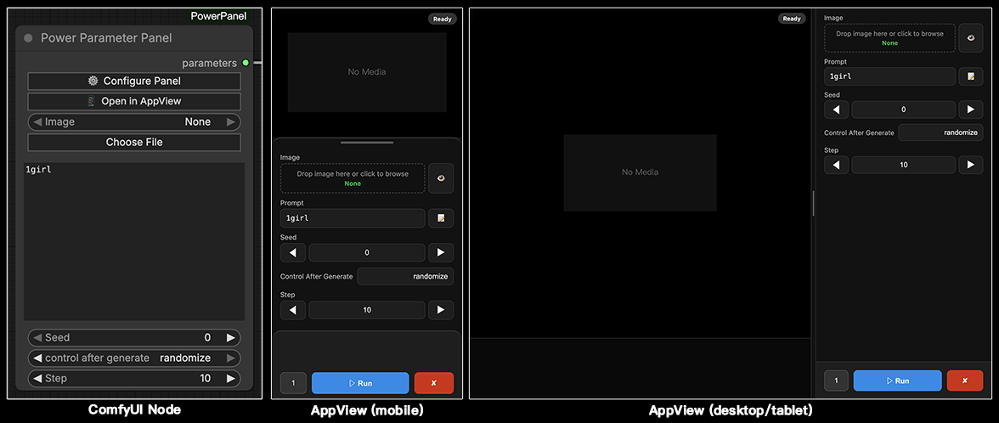

# ComfyUI-PowerPanel (AppView) 
使用此插件可以向任意工作流添加统一的参数面板, 并将其转换为更易于使用的 WebApp 界面  
**[[📃English](./README.md)]**   

## 预览


## 安装

#### 安装节点:
```bash
cd ComfyUI/custom_nodes
git clone https://github.com/lihaoyun6/ComfyUI-PowerPanel.git
```

## 使用方法 


## 致谢
- [ComfyUI](https://github.com/comfyanonymous/ComfyUI) @comfyanonymous  
